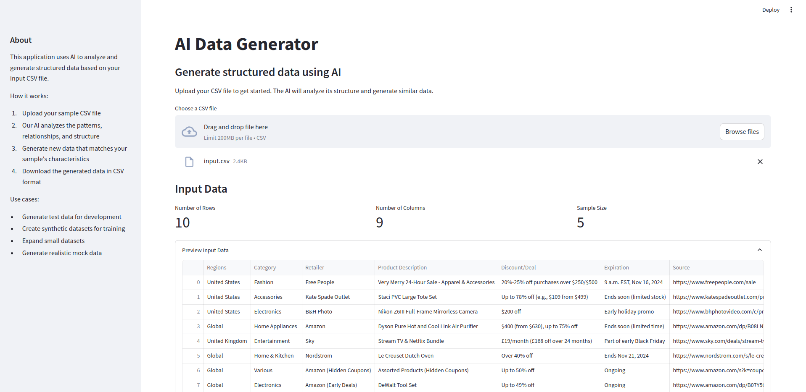
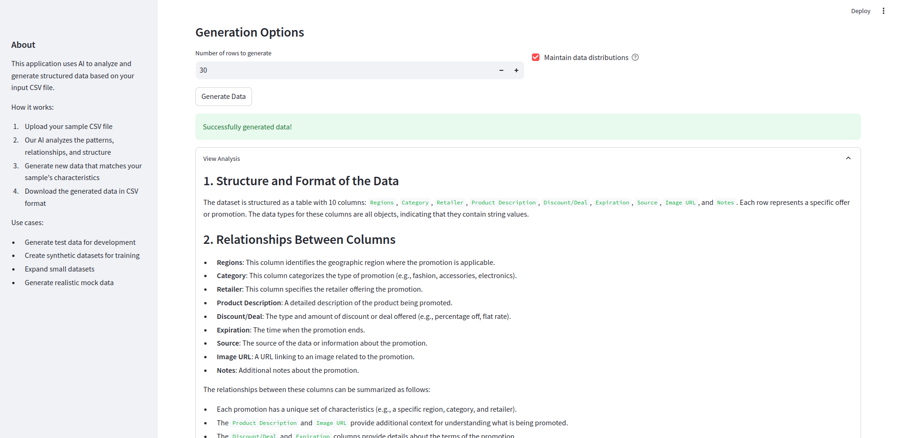
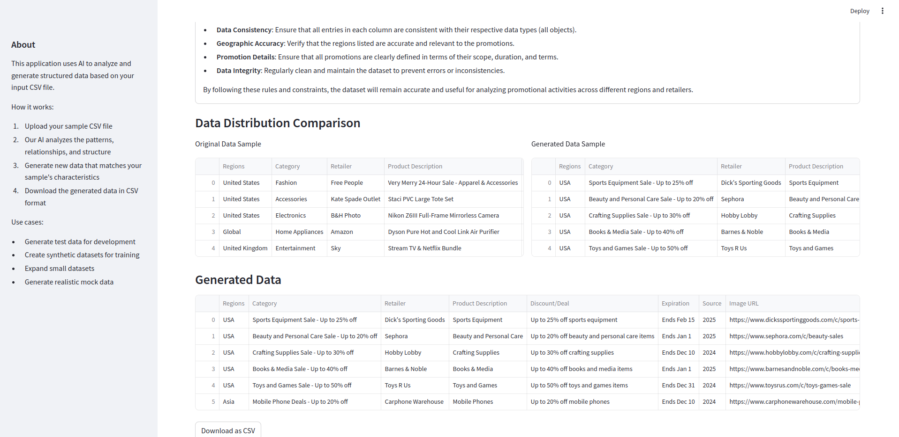

# AI Data Generator

A powerful AI-powered tool for generating structured data based on any input dataset. This application uses advanced AI to analyze your data structure and generate new, realistic data that maintains the patterns and relationships of your original dataset.

## Features

- 🔍 **Universal Data Analysis**: Automatically analyzes any CSV input to understand its structure and patterns
- 🤖 **AI-Powered Generation**: Uses advanced AI to generate realistic, coherent data
- 📊 **Distribution Maintenance**: Option to maintain statistical distributions from original data
- 📈 **Data Preview**: Interactive visualization of both input and generated data
- 💾 **Multiple Export Formats**: Save generated data as CSV or Excel

## Prerequisites

- Python 3.8 or higher
- Virtual environment (recommended)

## Setup

1. Clone the repository:
```bash
git clone <repository-url>
cd ai-data-generator
```

2. Create and activate a virtual environment:
```bash
python3 -m venv venv
source venv/bin/activate  # On Linux/Mac
# or
.\venv\Scripts\activate  # On Windows
```

3. Install dependencies:
```bash
pip install -r requirements.txt
```

4. Set up your API key:
Create a `.env` file in the project root and add your API key:
```
PERPLEXITY_API_KEY=your_api_key_here
```

## Using the Application

1. Start the web interface:
```bash
streamlit run app.py
```

2. Use the intuitive UI to:
   - Upload any CSV file
   - Preview and analyze the data
   - Configure generation options
   - Generate new data
   - Download results in your preferred format

## Web Interface Guide


*Upload your CSV file and preview the data structure*


*View detailed analysis of your data patterns*


*Configure data generation settings*


*Preview and download generated data*

## Input Format

The application accepts any well-structured CSV file:
- Must have consistent column headers
- Data should be properly formatted in each column
- No limit on number of columns or data types

## Project Structure

- `app.py`: Streamlit web interface
- `agents.py`: Core data processing and generation logic
- `requirements.txt`: Project dependencies
- `.env`: Environment variables (API keys)

## Advanced Features

1. **Data Analysis**
   - Column type detection
   - Pattern recognition
   - Relationship analysis
   - Distribution analysis

2. **Generation Controls**
   - Number of rows to generate
   - Distribution maintenance options
   - Format preservation

3. **Export Options**
   - CSV export
   - Excel export with formatting
   - Data validation

## Troubleshooting

1. **API Issues**:
   - Verify API key in `.env`
   - Check API rate limits
   - Ensure internet connectivity

2. **Input Data Issues**:
   - Verify CSV formatting
   - Check for missing headers
   - Ensure consistent data types

3. **Generation Issues**:
   - Try smaller batch sizes
   - Check memory usage
   - Verify column constraints

## Contributing

Contributions are welcome! Please feel free to submit a Pull Request.

## License

This project is licensed under the MIT License - see the LICENSE file for details.
